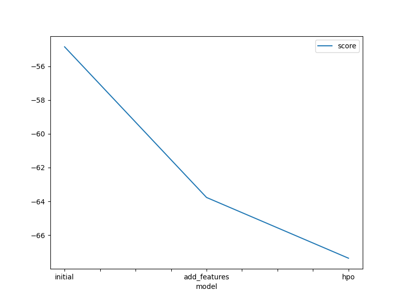
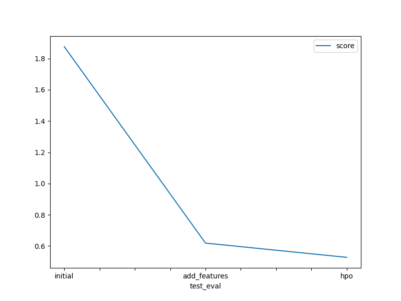

# Report: Predict Bike Sharing Demand with AutoGluon Solution
#### BENIDICTUS GALIH MAHAR PUTRA

## Initial Training
### What did you realize when you tried to submit your predictions? What changes were needed to the output of the predictor to submit your results?
I need to fill username and key from `kaggle.json` received from Kaggle token API. Set all negative values of predictions into `zero`. Created a shallow copy of submission then assign the predictions of the model.

### What was the top ranked model that performed?
It was `WeightedEnsemble_L3` with score_val `-63.75`, pred_time_val `71.9`, fit_time `495.49`, and data new features of `hour`, `season`, and `weather`.

## Exploratory data analysis and feature creation
### What did the exploratory analysis find and how did you add additional features?
For `hour` I set the as `datetime` when read as dataframe and assign as `.dthour`. 
For `season` and `weather` I set as `.astype(category)`.
For `rush_hour` I did a `.between` if the value is in between the values, it will return as `True`.
For `temperature_category`, `wind_category`, and `humidity_category` I did using `pandas.cut` so if the the value is between the `bins` it will categorize of each of the bins. Labels set as `False` so the categories are as `int`. 

### How much better did your model preform after adding additional features and why do you think that is?
For `hour` it because it will focus just on specific time and the distribution of the data become smaller but more insightful. Not focus on day in month but on opening hour.  
But when added new features data binding like `temp`, `windspeed`, `rush_hour`, and `humidity`, it became less accuracy and I hypothesize that this because of the curse of dimensionality of the data. 

## Hyper parameter tuning
### How much better did your model preform after trying different hyper parameters?
It was 4 times much better than without additional features and different parameters.

### If you were given more time with this dataset, where do you think you would spend more time?
I think I could use more modify (preprocessing and data binding) on the data itself and try other current model that could help to predict this data.

### Create a table with the models you ran, the hyperparameters modified, and the kaggle score.
|model|hpo1|hpo2| hpo3   | score   |
|--|--|--|--------|---------|
|initial|default|default| light  | 1.89050 |
|add_features|default|default| light  | 0.48821 |
|hpo|default|default| light  | 0.49440 |
, , 
### Create a line plot showing the top model score for the three (or more) training runs during the project.

### Create a line plot showing the top kaggle score for the three (or more) prediction submissions during the project.

## Summary
When modifying the hyperparameters using AutoGluon, it is better to use the value rather than using as `[...]` because of it will return error. By adding new features that are insightful and modify the base model using hyperparameter, it will improve the accuracy of the model. Also, you need to check if the features used in the training data was not dependable each other by using `heatmap` correlation. We need to consider the `curse of dimensionality` if we want to add further new features as in the experiment, it shows (on section `Advance Training`) the model's accuracy was not improved.     
